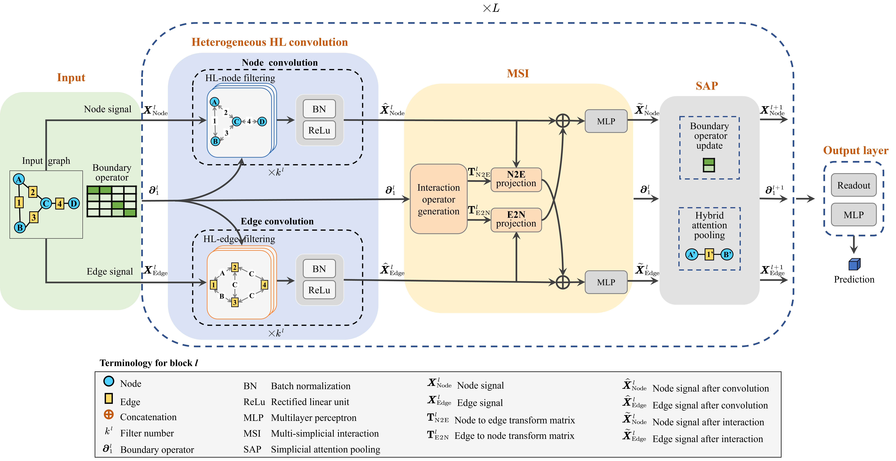

# HL-HGAT
Heterogeneous Graph Convolutional Neural Network via Hodge-Laplacian

<picture>
 
</picture>

This project introduces a novel approach to transform a traditional graph into a simplex graph, where nodes, edges, and higher-order interactions are characterized by different-dimensional simplices. We propose the Hodge-Laplacian Heterogeneous Graph Attention Network (HL-HGAT), which enables simultaneous learning of features on different-dimensional simplices.

In this HL-HGAT package, we provide the transformation of the original graph to a simplex graph. Then we provide a detailed implementation of the proposed model. HL-HGAT is built using PyG and Pytorch.

## Python environment setup with Conda

```bash
conda create -n HLHGCNN python=3.9
conda activate HLHGCNN
conda install pytorch==1.12.1 torchvision==0.13.1 torchaudio==0.12.1 cudatoolkit=10.2 -c pytorch

pip install -y torch-cluster==1.6.0     -f https://pytorch-geometric.com/whl/torch-1.12.1+cu102.html
pip install torch-scatter==2.0.9     -f https://pytorch-geometric.com/whl/torch-1.12.1+cu102.html
pip install torch-sparse==0.6.15      -f https://pytorch-geometric.com/whl/torch-1.12.1+cu102.html
pip install torch-geometric -f https://data.pyg.org/whl/torch-1.12.1+cu102.html

conda install -c conda-forge timm
conda install -c anaconda networkx
conda install -c conda-forge mat73
conda install -c conda-forge torchmetrics
conda clean --all
```

<picture>
 
</picture>


